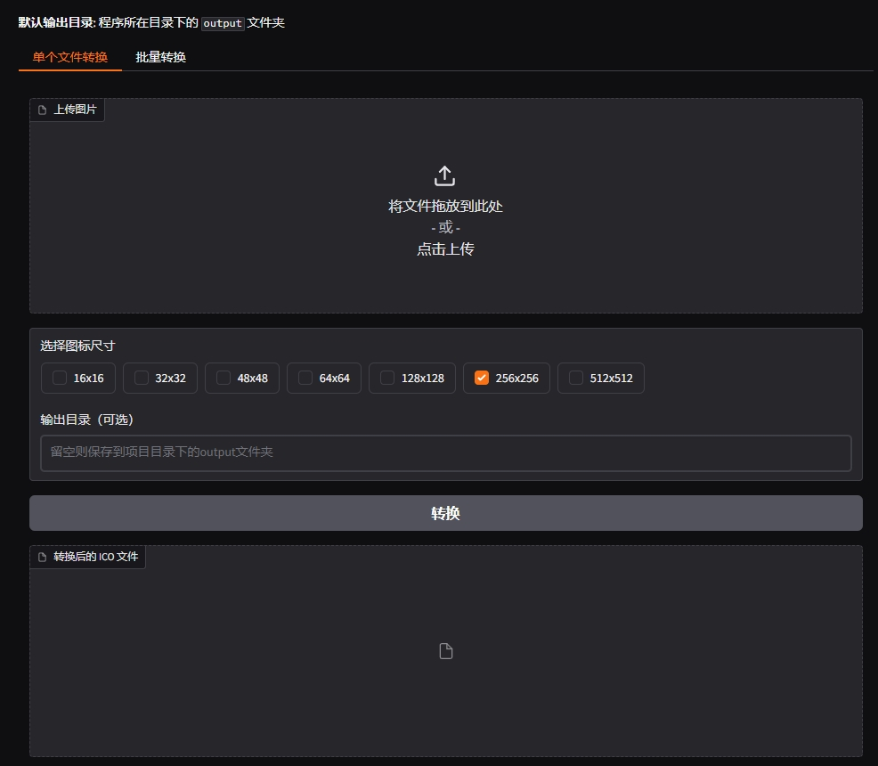

# 高清图片转ICO工具

一个简单易用的图片转ICO转换工具，支持单个文件转换和批量转换，可生成多种尺寸的图标文件。

## 预览



## 特性

- 🖼️ 支持常见图片格式转换（PNG, JPG, JPEG, BMP, GIF）
- 🎯 可选择多种输出尺寸（16x16 到 512x512）
- 📦 支持单个文件转换和批量转换
- 💾 自定义输出目录
- 🔍 高质量转换，使用 LANCZOS 算法
- 🌐 基于Web界面，使用方便
- ✨ 支持生成多尺寸ICO文件

## 安装说明

1. 确保已安装Python 3.7+
2. 克隆项目到本地：
```bash
git clone https://github.com/[你的用户名]/image-to-ico.git
cd image-to-ico
```

3. 安装依赖：
```bash
pip install -r requirements.txt
```

## 使用方法

### Windows用户

直接运行 `run-gradio-webui.bat`

或者使用命令行：
```bash
python Image-to-ico.py
```

### 其他系统用户

```bash
python Image-to-ico.py
```

启动后会自动打开浏览器，访问本地Web界面。

## 功能说明

### 单个文件转换

1. 点击"上传图片"选择要转换的图片文件
2. 选择需要的图标尺寸（可多选）
3. 可选：指定输出目录（默认保存在程序目录下的output文件夹）
4. 点击"转换"按钮开始转换
5. 转换完成后会显示文件保存位置

### 批量转换

1. 在输入框中填写包含图片的文件夹路径
2. 选择需要的图标尺寸（可多选）
3. 可选：指定输出目录（默认保存在程序目录下的output文件夹）
4. 点击"开始批量转换"按钮
5. 等待转换完成，查看转换结果

## 支持的格式

### 输入格式
- PNG
- JPG/JPEG
- BMP
- GIF

### 输出格式
- ICO（Windows图标文件）

## 注意事项

- 建议上传分辨率大于或等于最大目标尺寸的图片
- 程序会自动创建输出目录
- 如果输出目录已存在同名文件，会自动覆盖
- 批量转换时会保持原文件名（仅改变扩展名为.ico）

## 技术栈

- Python
- Gradio - Web界面框架
- Pillow - 图像处理库

## 贡献指南

欢迎提交Issue和Pull Request！

## 许可证

MIT License - 详见 [LICENSE](LICENSE) 文件

## 开发者

[你的名字/ID]